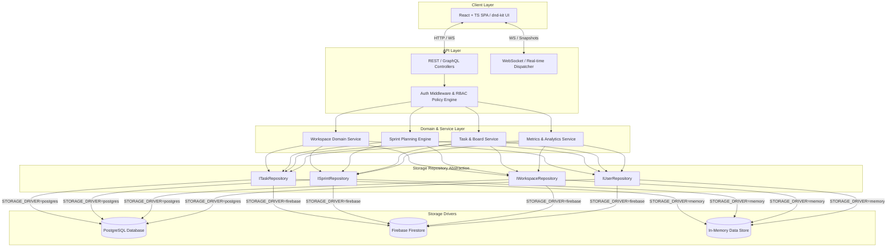

# 01. System Architecture Overview

## 1. High-Level Architecture Topology

The Team Kanban & Sprint Management Platform is designed using a **Clean Architecture** approach. The core application logic and domain models remain completely isolated from database infrastructure, external services, and transport layers.



---

## 2. Decoupled Architectural Layers

1. **Presentation Layer (Frontend):**
   - Built with **React**, **TypeScript**, **Zustand**, and **dnd-kit**.
   - Interacts with the backend solely via standardized API endpoints and real-time events.
   - Operates identically regardless of which backend storage driver is active.

2. **Transport & Controller Layer:**
   - Exposes RESTful HTTP endpoints and WebSocket connections.
   - Can run as a standalone **Node.js Fastify/Express server** or as serverless **Firebase Cloud Functions**.

3. **Domain & Business Logic Layer:**
   - Implements sprint mechanics, capacity estimations, task ordering, velocity calculations, and permission validation.
   - Zero dependency on database drivers or ORMs.

4. **Repository & Driver Abstraction Layer:**
   - Defines strict TypeScript interfaces for all data mutations and reads.
   - Provides concrete driver implementations for **PostgreSQL**, **Firebase Firestore**, and **In-Memory**.

---

## 3. Storage Driver Factory Pattern

The active storage driver is resolved at runtime via environment configuration using a factory pattern:

```typescript
// Example Storage Factory Pattern Blueprint
export interface IRepositoryFactory {
  getTaskRepository(): ITaskRepository;
  getSprintRepository(): ISprintRepository;
  getWorkspaceRepository(): IWorkspaceRepository;
  getUserRepository(): IUserRepository;
}

export function createRepositoryFactory(driverType: 'postgres' | 'firebase' | 'memory'): IRepositoryFactory {
  switch (driverType) {
    case 'postgres':
      return new PostgresRepositoryFactory();
    case 'firebase':
      return new FirebaseRepositoryFactory();
    case 'memory':
    default:
      return new MemoryRepositoryFactory();
  }
}
```

---

## 4. Real-time Concurrency & Event Handling

| Feature | PostgreSQL / Memory Driver Mode | Firebase Driver Mode |
|---|---|---|
| **Real-time Protocol** | WebSockets (Socket.io or native `ws`) | Firebase Firestore Realtime Snapshots (`onSnapshot`) |
| **Concurrency Control** | Optimistic concurrency locking via integer `version` field | Optimistic locking + Firestore atomic transactions |
| **Conflict Resolution** | Server rejects stale `version` updates with HTTP 409; client re-fetches | Firestore transaction fails on stale read; retry loop |
| **Event Broadcasting** | Broadcast diffs (`{ entity_id, field_diff }`) over WebSocket channels | Native document change listeners auto-sync connected clients |

---

## 5. Deployment Topology Comparison

```
+-----------------------------------------------------------------------------------------+
|                                    DEPLOYMENT MODES                                     |
+-----------------------------------------------------------------------------------------+
| Mode A: Firebase Serverless      | Mode B: Node + PostgreSQL      | Mode C: Standalone Dev |
| -------------------------------- | ------------------------------ | ---------------------- |
| Frontend: Firebase Hosting (CDN) | Frontend: Vercel / Netlify     | Frontend: Vite Dev     |
| API: Firebase Cloud Functions    | API: Node.js (Railway/Render)  | API: Express in-proc   |
| Database: Firestore NoSQL        | Database: Managed Postgres SQL | Database: In-Memory    |
| Auth: Firebase Authentication    | Auth: JWT Access/Refresh      | Auth: Mock Auth Token  |
+-----------------------------------------------------------------------------------------+
```

---

## 6. Next Steps & References

- Proceed to [02-data-models-and-storage.md](file:///c:/Users/ayush/Pictures/kanban/docs/02-data-models-and-storage.md) to inspect detailed schemas for all three storage drivers.
- Proceed to [03-backend-and-api-specs.md](file:///c:/Users/ayush/Pictures/kanban/docs/03-backend-and-api-specs.md) for Repository Interface specifications.
